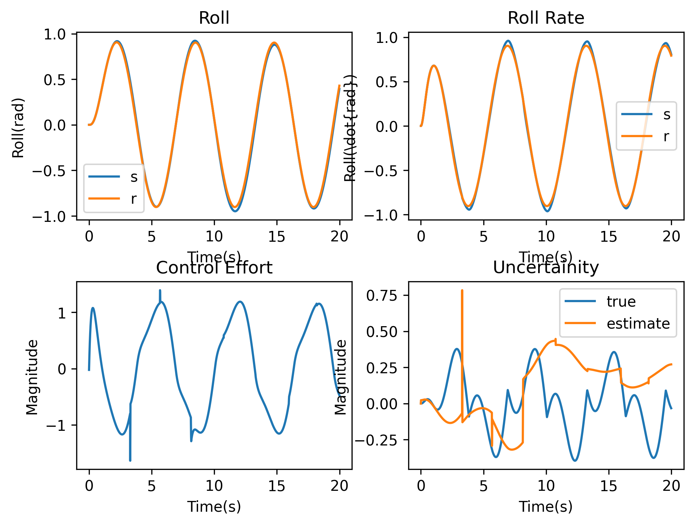

# DeepMRAC
This code implments Deep Model Reference Adaptive Controller for a WingRock System. This is the course project of adaptive control course(ECE577) conducted in Winter 2022@IIITD.

- [Main Paper](https://arxiv.org/abs/1909.08602)
- [Singular Value Maximizing Buffer](https://ieeexplore.ieee.org/document/5991481)
- [Generative Network](https://ieeexplore.ieee.org/document/8619431)

